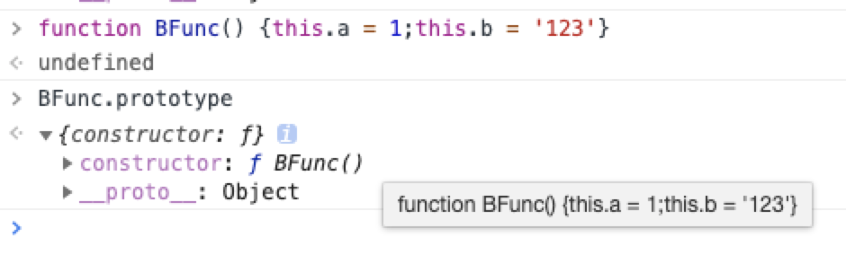
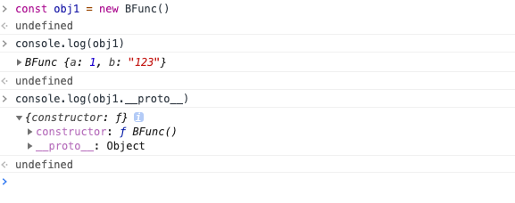
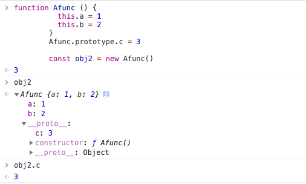
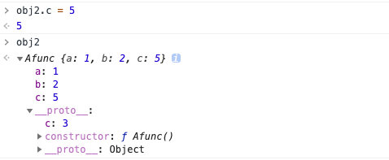
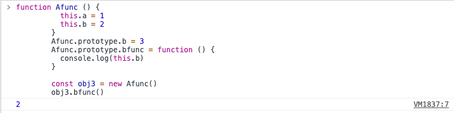

### 关于原型链


##### 一、从`prototype`最初始的形态开始
  1. 编写一个最简单的函数，打印其`prototype`的值
      ```js
        // 一个最简单的函数
        function BFunc() {
          this.a = 1;
          this.b = '123';
        }
      ```
      
      如图所示：一个函数最初始的`prototype`有两个属性：`constructor`和`__proto__`, `constructor`的值很明显就是这个函数本身, `__proto__`的值则为`Object`（因为所有对象的最顶层原型都是`Object.prototype`）。


  2. 通过函数实例化一个对象, 打印他的`__proto__`属性
      
      如图所示：此对象的`__proto__`属性很明显指向的就是`Bfunc`的`prototype`属性, 也就是他的构造函数的 `prototype`(原型对象)。
      也就是说，对于一个对象来说, 其`__proto__`属性指向的就是他构造函数的`prototype`。


#### 二、通过`prototype`来实现继承

  1. 给`prototype`添加属性
      ```js
        function Afunc () {
          this.a = 1
          this.b = 2
        }
        Afunc.prototype.c = 3
        
        const obj2 = new Afunc()
      ```
      

      如图所示：在`Afunc`的实例对象`obj2`上，不能直接看到在`prototype`上定义的`c属性`，但是使用`obj2.c`依然可以访问到`c属性`, 这是因为**当试图访问一个对象的属性时，它不仅仅在该对象上搜寻，还会搜寻该对象的原型，以及该对象的原型的原型，依次层层向上搜索，直到找到一个名字匹配的属性或到达原型链的末尾。**
  2. 给对象添加一个已经存在于它原型链上的属性会发生什么？
      
      如图所示：给obj2添加一个c属性后，它原型上的c属性是依然存在的，也就是说，**一个对象原型链上的同名属性是可以并行存在的**

  3. `prototype`上函数的指向问题
      ```js
        // 在 prototype 上定义一个 使用了 this 的函数

        function Afunc () {
          this.a = 1
          this.b = 2
        }
        Afunc.prototype.b = 3
        Afunc.prototype.bfunc = function () {
          console.log(this.b)
        }
        
        const obj3 = new Afunc()
        obj3.bfunc() // 运行结果为2å

      ```
      

      如图所示：`prototype`伤的函数中打印`this.b`的值为`2`而非`3`，所以`prototype`上的函数中`this`指向的是最终继承`prototype`的实例化的对象
  4. 直接给`prototype`赋值会怎样
    原型链可能会被打破，即构造函数的`prototype`对象的原型信息可能会发生丢失。
    可以通过`Object.create`函数创建新的对象，此函数的第一个参数值将会是被创建对象的原型。
  5. `class`语法
      class 仅仅是语法糖，其依然是基于原型来实现继承的
